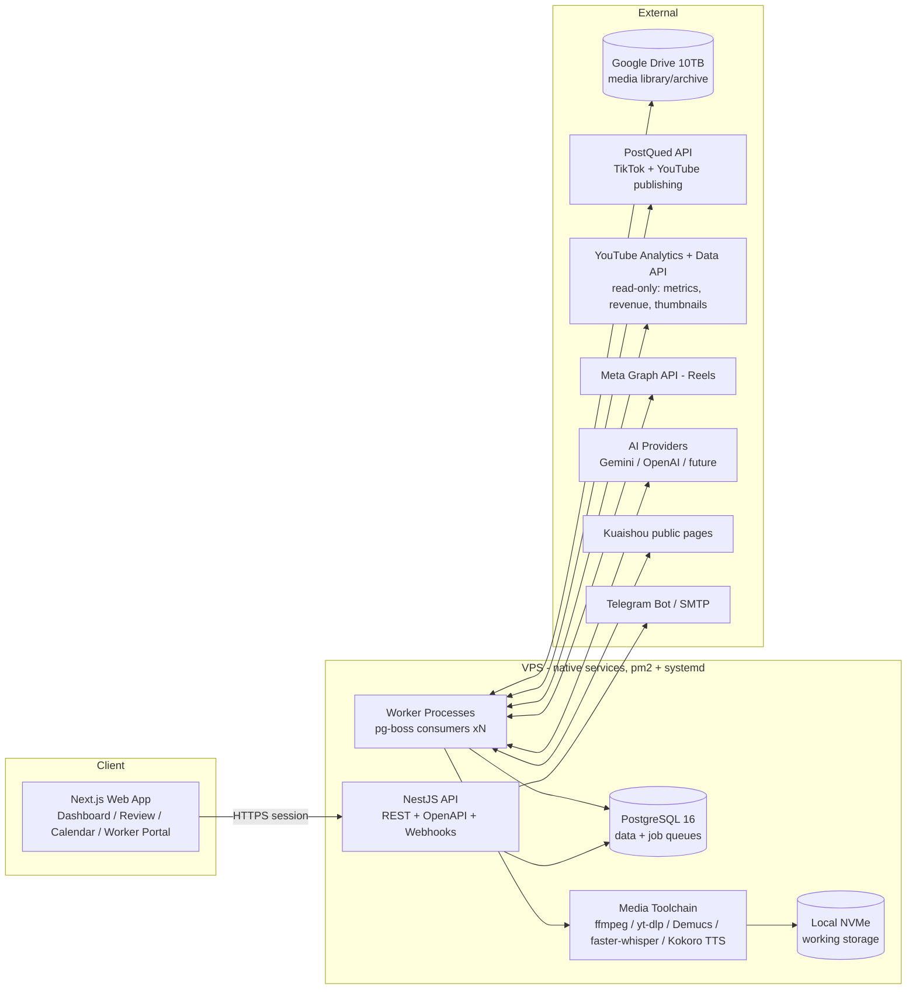

# 02 — System Architecture

## 1. Architectural Style: Modular Monolith + Worker Fleet

A microservice mesh would multiply hosting cost and ops burden for a small team. Instead: **one monorepo, three deployable processes**, strict internal module boundaries so any module can be split out later.

**No Docker (Owner decision 2026-07-14):** all services run natively — Postgres 16 native install, Node apps under pm2, Caddy native. Queue system is **pg-boss** (Postgres-backed), eliminating Redis entirely: one less service, queues included in DB backups, and native Windows dev works out of the box.



## 2. Tech Stack & Rationale

| Layer | Choice | Why |
|---|---|---|
| Frontend | **Next.js 15 + TypeScript + Tailwind + shadcn/ui + TanStack Query** | Fast to build a dense dashboard; SSR for snappy loads; huge ecosystem |
| API | **NestJS (Fastify) + OpenAPI** | Enforced module structure (good for a growing codebase & multiple contributors), typed REST client auto-generated for the frontend |
| Auth | **Auth.js (credentials) + DB sessions + RBAC guard in Nest** | Self-hosted, free, no third-party auth bills |
| DB | **PostgreSQL 16 + Prisma** | Relational fits this domain (many joins: accounts↔content↔jobs↔metrics); Prisma for velocity & migrations |
| Queue | **pg-boss (Postgres-backed)** | Delayed/cron/retryable jobs with zero extra infrastructure — no Redis service to run, queues live in the same DB and are backed up with it; ample at our volumes (thousands of jobs/day vs pg-boss's tested tens-of-thousands/hour) |
| Media | **ffmpeg, yt-dlp, Demucs, faster-whisper, Kokoro TTS** | All free/self-hosted; covers download, trim, mux, vocal separation, transcription, voiceover |
| Storage | **Local NVMe (hot) + Google Drive API (library)** | Uses your existing 10 TB; zero storage bills |
| Deploy | **Native: pm2 (Node apps) + systemd (Postgres, Caddy) — no Docker (Owner decision)** | Simple `pm2 deploy`-style updates; Caddy auto-TLS; setup script in `deploy/` |
| Observability | **pino logs, in-app jobs dashboard (reads pg-boss tables + job_runs), health endpoints, Uptime Kuma (optional)** | Free, sufficient |

## 3. Monorepo Folder Structure

```
socialcreatorpilot/
├── apps/
│   ├── web/                      # Next.js dashboard
│   │   └── src/
│   │       ├── app/              # routes: dashboard, accounts, sources, review,
│   │       │                     #   ideas, dramas, calendar, analytics, incidents,
│   │       │                     #   workers (portal), settings
│   │       ├── components/
│   │       ├── features/         # feature-sliced UI logic
│   │       └── lib/              # generated API client, auth
│   ├── api/                      # NestJS
│   │   └── src/
│   │       ├── modules/
│   │       │   ├── auth/         ├── users/        ├── accounts/      # connections + channel profiles
│   │       │   ├── sources/      # watched profiles + bulk import
│   │       │   ├── content/      # content items, assets, review queue
│   │       │   ├── ai/           # providers, keys, routing, cache
│   │       │   ├── ideas/        # research, idea board, briefs
│   │       │   ├── dramas/       # series, episodes
│   │       │   ├── tasks/        # worker task dispatch
│   │       │   ├── scheduling/   ├── publishing/   ├── analytics/
│   │       │   ├── incidents/    ├── notifications/├── storage/
│   │       │   └── system/       # health, settings, audit
│   │       └── common/           # guards, interceptors, rbac
│   └── worker/                   # pg-boss processors (separately scalable)
│       └── src/
│           ├── processors/
│           │   ├── ingest/       # watcher, downloader, dedupe, trim
│           │   ├── media/        # ffmpeg render, demucs, thumbnails
│           │   ├── ai/           # analysis, writing, metadata, tts
│           │   ├── publish/      # platform publish + verify
│           │   ├── analytics/    # metric sync jobs
│           │   └── maintenance/  # cleanup, backup, token refresh
│           └── lib/
├── packages/
│   ├── db/                       # Prisma schema + client
│   ├── shared/                   # zod schemas, types, constants
│   ├── ai-providers/             # provider adapters + key pool (doc 05)
│   ├── publish-adapters/         # youtube / facebook / postqued (doc 06)
│   ├── source-adapters/          # kuaishou / generic-url (yt-dlp wrapper)
│   └── storage/                  # tiered storage client (local + Drive)
├── deploy/                       # setup scripts, pm2 ecosystem config, Caddyfile, systemd notes
└── docs/
```

**Boundary rule:** apps never call external APIs directly — only through `packages/*` adapters. That is what makes PostQued, Gemini, or even Drive swappable.

## 4. API Architecture

- **REST, versioned (`/api/v1`)**, OpenAPI spec auto-generated → typed client for `apps/web`. REST (not tRPC/GraphQL) so future scripts/mobile/Zapier-style integrations are trivial.
- **Auth:** cookie session (HttpOnly, SameSite) for the web app; scoped **API tokens** for programmatic access (e.g., worker upload scripts).
- **RBAC** enforced by Nest guards per route + per-resource ownership checks (worker sees only own tasks).
- **Webhooks in:** `/webhooks/meta` (page/video status), `/webhooks/postqued` (if available) — signature-verified.
- **Server-Sent Events** `/events` for live dashboard updates (queue progress, new review items) — cheaper than websockets to operate, sufficient for one-way updates.
- **Idempotency keys** on all mutation endpoints that trigger jobs (prevents double-publish from double-clicks).

## 5. Queue System (pg-boss)

| Queue | Jobs | Concurrency | Retry policy |
|---|---|---|---|
| `watcher` | poll Kuaishou profiles, poll competitor channels | 2 | 3× exp backoff; failures create source Incident |
| `download` | fetch source video, verify, hash, dedupe | 2 (bandwidth-bound) | 5× exp backoff |
| `media` | trim, transcode, demucs separation, merge VO, thumbnails, subtitles | = CPU cores − 2 | 2× (deterministic work) |
| `ai` | analysis, narration, ideas, briefs, metadata | 4 (rate-limit governed by key pool) | fail-over inside key pool, then 3× |
| `tts` | voiceover synthesis | 2 | provider fallback then 3× |
| `publish` | upload + set metadata + verify-live follow-up | 3, **rate-limited per account** | platform-aware backoff; terminal failures → Incident + Draft |
| `analytics` | nightly/interval metric syncs | 2 | 3×, quota-aware scheduling |
| `storage` | Drive upload/retrieval, local cleanup | 2 | 5× (resumable uploads) |
| `maintenance` | token refresh, cache eviction, DB backup, orphan cleanup | 1 | 3× |

Rules: every job **idempotent** (keyed by entity ID + step via pg-boss `singletonKey`), state transitions written to DB inside the job so a crashed worker resumes cleanly; recurring jobs (watchers, syncs) use pg-boss cron schedules registered from DB config at boot; concurrency via per-queue `teamSize`/`teamConcurrency`; admin-only jobs page in the dashboard reads pg-boss tables + `job_runs` for inspection/retry.

## 6. Storage Strategy — Local Hot Tier + Google Drive Library

Google Drive can't be a processing filesystem (no random access; API latency), so:

1. **Hot (local NVMe):** everything currently being processed or scheduled ≤ 7 days out. Working dir per content item: `/data/items/{id}/{original,processed,voiceover,final,thumbs}`.
2. **Library (Google Drive, 10 TB):** after final render (and after publish + verification), original + final are uploaded via **resumable Drive API uploads** into a mirrored folder tree (`/SCP/{channel}/{yyyy-mm}/{itemId}/`). DB stores Drive `fileId` + md5. Local copies deleted once Drive md5 verified — except items scheduled within retention window.
3. **Restore path:** re-publish or re-edit pulls from Drive back to hot tier automatically (`storage` queue).

Caveats designed for:
- **750 GB/day/account Drive upload cap** and per-file API quotas → `storage` queue rate-limits and spreads uploads; supports multiple Drive accounts (each ≈ its own cap) if you have them.
- Drive API quota (default ~12k queries/min project-wide) is ample at our volumes.
- **Never** serve media to platforms "from Drive links" — always local file → platform upload API.
- Nightly `pg_dump` + config backup also pushed to Drive (separate folder, 30-day rotation).

Disk sizing: at ~200 videos/day × ~100 MB average × 7-day hot retention ≈ 140 GB working set → a 360 GB NVMe VPS is comfortable; alert at 80% with automatic oldest-published-first eviction.

## 7. Deployment & Scaling Path

- **v1:** single VPS (8 vCPU / 16 GB / 360 GB NVMe class), native services: Postgres 16 + Caddy via apt/systemd; `web`, `api`, `worker ×2` under **pm2** (auto-restart, log rotation, `pm2 startup` for boot persistence). One idempotent `deploy/setup.sh` provisions a fresh Ubuntu VPS; updates = `git pull && pnpm build && pm2 reload all`. Daily off-site backups (Drive).
- **Dev (Windows):** native PostgreSQL 16 installer + `pnpm dev` — no other services needed (pg-boss lives in Postgres).
- **Scale step 1:** raise pm2 `worker` instances / move `media` queue workers to a second CPU-heavy VPS (workers only need Postgres reachability).
- **Scale step 2:** managed Postgres or dedicated DB node.
- **Scale step 3 (only if needed):** split `publishing` and `ai` modules into their own services — module boundaries already match.
- GPU note: Demucs/Whisper run on CPU fine at ~200 videos/day (≈1–2 min/video); a GPU box is an optional later speed upgrade, not a requirement.
