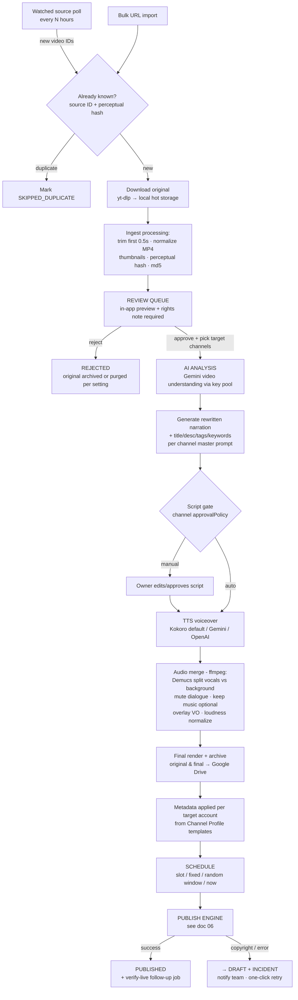
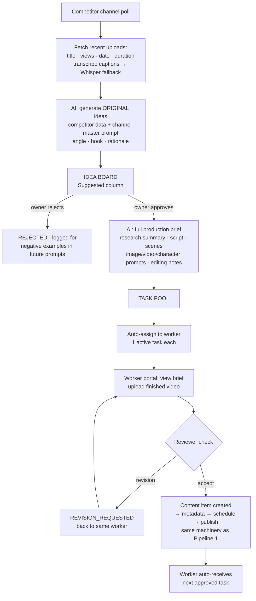
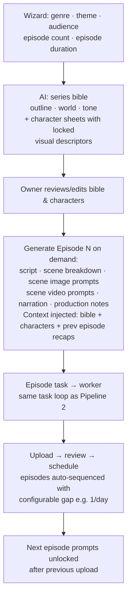
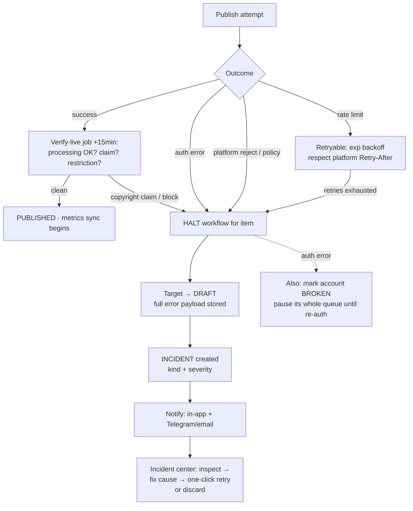

# 04 — Workflow Diagrams & State Machines

## 1. Pipeline 1 — Public Content Repurposing (Kuaishou → Publish)

**Content item state machine:** `INGESTED → REVIEW_PENDING → APPROVED → ANALYZING → SCRIPT_READY → SCRIPT_APPROVED → TTS_DONE → RENDERED → METADATA_READY → SCHEDULED → PUBLISHING → PUBLISHED` with side exits to `REJECTED` (review), `DRAFT` (publish failure/copyright), `FAILED` (unrecoverable processing error, retryable). Every transition timestamps + records actor (user or job).

## 2. Pipeline 2 — AI Content Research & Worker Production

## 3. Pipeline 3 — AI Drama Series (TikTok)

Consistency mechanics: character sheets are immutable per series (edits create a new version, flagged on affected episodes); every episode generation includes bible + sheets + auto-generated recap of episodes 1..N-1 (recaps cached, cheap).

## 4. Publish Failure / Copyright Protocol (all pipelines)

## 5. Ingest Watcher Detail (dedupe correctness)

1. Poll source → list latest video entries (ID, title, publish date).
2. `source_videos` upsert by (source, platformId) — existing = stop.
3. New → enqueue download. After download compute md5 + perceptual hash (pHash of sampled frames).
4. pHash within Hamming distance threshold of an existing item → flag `NEAR_DUPLICATE`, still enters review queue with a "possible duplicate of X" banner (reviewer decides).
5. Watcher errors (layout change, blocked, geo) → source `status=ERROR` + incident; watcher auto-pauses after 3 consecutive failures instead of hammering.

## 6. Review Queue UX Contract

- Video player with speed controls + trim preview (shows exactly what the 0.5 s trim removed; adjustable per item).
- Required before approve: target channel(s) + rights note (prefilled from source default).
- Batch actions: approve/reject multiple; keyboard shortcuts (space=play, A=approve, R=reject).
- Approve triggers Pipeline 1 automatically; queue shows live downstream status per item.
